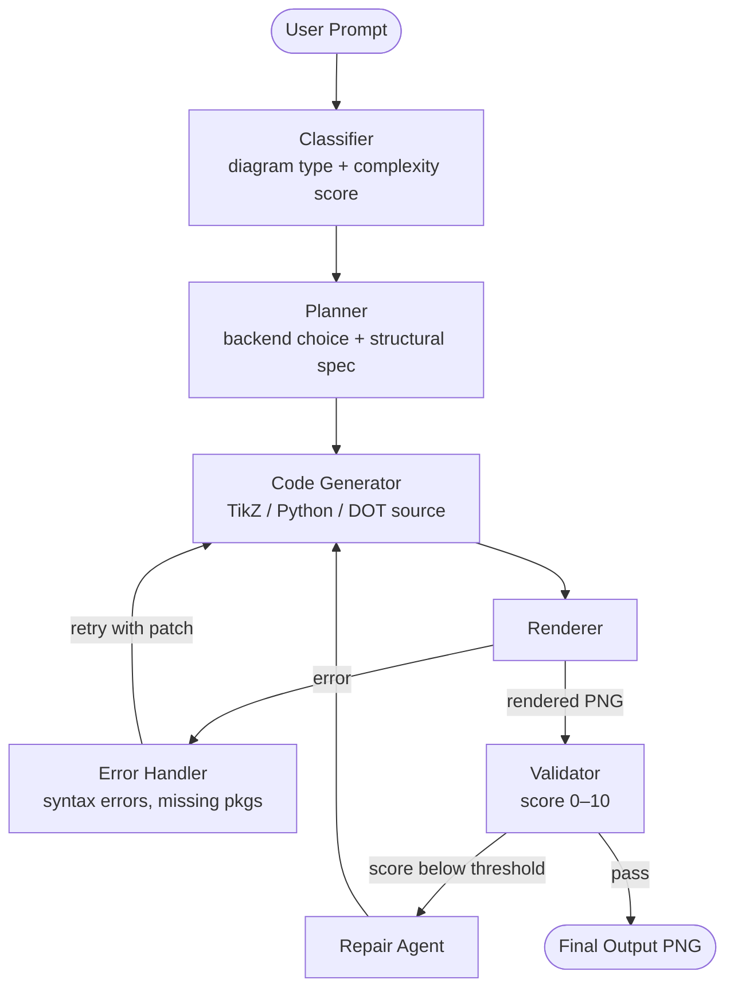

# VisualCentricBenchmark

A diagram agent that generates textbook-quality math diagrams using TikZ, Matplotlib, and Graphviz.

---

## Getting Started

### Prerequisites

| Tool | Required for | Install |
|---|---|---|
| Python ≥ 3.11 | everything | [python.org](https://python.org) |
| [uv](https://docs.astral.sh/uv/) | package management | `pip install uv` |
| pdflatex (TeX Live / MiKTeX) | TikZ diagrams | [tug.org/texlive](https://tug.org/texlive/) |
| [Graphviz](https://graphviz.org/download/) | graph/tree diagrams | system package manager |

Matplotlib diagrams work out of the box — no external binaries needed.

### Install

```bash
git clone <repo>
cd VisualCentricBenchmark
uv sync
```

### Set your API key

```bash
cp .env.example .env
# edit .env and set ANTHROPIC_API_KEY=sk-ant-...
```

`config.py` loads `.env` automatically via `python-dotenv` — no shell sourcing needed. Alternatively, export directly:

```bash
export ANTHROPIC_API_KEY=sk-ant-...
```

---

## Usage

```bash
uv run agent.py "<description>"
uv run agent.py "<description>" --output <filename>
uv run agent.py "<description>" --model <model-id>
uv run agent.py "<description>" --max-turns <n>
```

### Examples

```bash
# Geometric diagram (TikZ)
uv run agent.py "a right triangle with legs labeled a, b and hypotenuse c, with a small square at the right angle"

# Function plot (Matplotlib)
uv run agent.py "sine and cosine plotted on [-2pi, 2pi] with a legend" --output trig.png

# Graph / tree (Graphviz)
uv run agent.py "binary search tree containing 5, 3, 7, 1, 4, 6, 8" --output bst.png

# Finite automaton (Graphviz)
uv run agent.py "DFA that accepts strings ending in 01 over alphabet {0,1}" --output dfa.png

# Commutative diagram (TikZ)
uv run agent.py "commutative square with maps f, g, h, k between objects A, B, C, D"

# Use a cheaper model
uv run agent.py "unit circle with labeled angles" --model claude-sonnet-4-5-20250929
```

Diagrams are saved to `output/` by default. Progress is printed to stderr; the final JSON result is printed to stdout.

### Output

```jsonc
{
  "status": "complete",        // "complete" | "max_turns" | "error"
  "message": "...",            // agent's closing message
  "output": "output/bst.png"  // path to saved file, or null
}
```

Exit code `0` on success, `1` on failure.

---

## Dialogue Server

The agent can also run as a persistent HTTP server that supports multi-turn conversations. Each session keeps its full message history and a versioned render cache, so users can refine diagrams iteratively.

### Start

```bash
uv run uvicorn server:app --reload
# or
uv run python server.py
```

Default: `http://127.0.0.1:8000`. Override with `SERVER_HOST` / `SERVER_PORT` in `.env`.

### Endpoints

| Method | Path | Description |
|--------|------|-------------|
| `POST` | `/sessions` | Create a session → `{"session_id": "..."}` |
| `POST` | `/sessions/{id}/messages` | Send a message; returns SSE stream |
| `GET` | `/sessions/{id}/renders/{render_id}` | Fetch a rendered PNG |
| `GET` | `/sessions/{id}` | Session metadata |
| `DELETE` | `/sessions/{id}` | Delete a session |

Interactive API docs: `http://127.0.0.1:8000/docs`

### Dialogue flow

```bash
# 1. Create a session
curl -s -X POST http://localhost:8000/sessions
# → {"session_id": "a3f9..."}

# 2. Send a message (streams SSE)
curl -s -N -X POST http://localhost:8000/sessions/a3f9.../messages \
  -H "Content-Type: application/json" \
  -d '{"content": "sine and cosine on [-2pi, 2pi]"}'

# 3. Refine in the same session
curl -s -N -X POST http://localhost:8000/sessions/a3f9.../messages \
  -H "Content-Type: application/json" \
  -d '{"content": "make the lines thicker and add grid lines"}'

# 4. Fetch the latest rendered image
curl -s http://localhost:8000/sessions/a3f9.../renders/v2 --output refined.png
```

### SSE event reference

Every `POST /sessions/{id}/messages` response is a `text/event-stream`. Each frame:

```
event: <type>
data: <json>

```

| Event | Payload | When |
|-------|---------|------|
| `text_delta` | `{"delta": "..."}` | Streaming text token from the model |
| `tool_start` | `{"tool": "render_matplotlib", "input": "..."}` | Tool call dispatched |
| `tool_result` | `{"tool": "render_matplotlib"}` | Tool call returned |
| `render_ready` | `{"render_id": "v1", "backend": "matplotlib"}` | New PNG available — fetch via `/renders/{render_id}` |
| `validate_result` | `{"render_id": "v1", "score": 8.5, "passed": true, "issues": [...], "suggestions": [...]}` | Visual validation ran |
| `turn_complete` | `{"reply": "...", "render_id": "v1"}` | Agent finished; ready for next message |
| `error` | `{"message": "..."}` | Unrecoverable error |

### Render versioning

Every successful render is stored in the session as `v1`, `v2`, etc. The session tracks `current_render_id` (always the latest). All previous renders remain accessible via `/renders/{render_id}` for the lifetime of the session (default TTL: 1 hour).

---

## Vue 3 Frontend

A Vue 3 + TypeScript frontend scaffold is included under `frontend/` and is wired to the dialogue API (`/sessions`, `/sessions/{id}/messages` SSE, `/renders/{render_id}`).

### Start

```bash
cd frontend
npm install
npm run dev
```

Use `.env.example` to override API base URL if needed:

```bash
VITE_API_BASE_URL=http://127.0.0.1:8000
```

---

## Configuration

All settings are controlled by environment variables. Copy `.env.example` to `.env` and edit as needed.

### Required

| Variable | Description |
|---|---|
| `ANTHROPIC_API_KEY` | Your Anthropic API key ([console.anthropic.com](https://console.anthropic.com)) |

### Model

| Variable | Default | Description |
|---|---|---|
| `DIAGRAM_MODEL` | `claude-opus-4-6` | Claude model for the agent loop and visual validation. Use `claude-sonnet-4-5-20250929` for lower cost. |

### External binary paths

Only set these if the binaries are not on your `PATH`.

| Variable | Default | Description |
|---|---|---|
| `PDFLATEX_PATH` | `pdflatex` | Path to the `pdflatex` executable. Required for TikZ diagrams. |
| `DOT_PATH` | `dot` | Path to the Graphviz `dot` executable. Required for Graphviz diagrams. |

**Windows example** (if not on PATH):
```
PDFLATEX_PATH=C:\texlive\2024\bin\windows\pdflatex.exe
DOT_PATH=C:\Program Files\Graphviz\bin\dot.exe
```

### Agent behaviour

| Variable | Default | Description |
|---|---|---|
| `MAX_AGENT_TURNS` | `20` | Maximum Claude API round-trips per request. Each render + inspection costs ~2 turns. |
| `MAX_REPAIR_ATTEMPTS` | `3` | How many times the agent tries to fix a broken diagram before giving up. |
| `VISUAL_SCORE_THRESHOLD` | `7.0` | Minimum visual validation score (0–10) to accept a render without repair. |

### Timeouts

| Variable | Default | Description |
|---|---|---|
| `RENDER_TIMEOUT` | `60` | Seconds before a pdflatex or Graphviz subprocess is killed. |
| `SANDBOX_TIMEOUT` | `30` | Seconds before the sandboxed Matplotlib subprocess is killed. |

### Server / sessions

| Variable | Default | Description |
|---|---|---|
| `SERVER_HOST` | `127.0.0.1` | Host the uvicorn server binds to. |
| `SERVER_PORT` | `8000` | Port the uvicorn server listens on. |
| `SESSION_TTL_SECONDS` | `3600` | Idle seconds before a session is eligible for cleanup. |
| `MAX_SESSIONS` | `100` | Maximum concurrent sessions. New requests return `503` when the limit is reached. |

---

## Architecture

### Workflow



### Backend selection

| Diagram type | Best backend | Fallback |
|---|---|---|
| Geometric figures, proofs | TikZ | Matplotlib |
| Function plots, data visualization | Matplotlib | TikZ (pgfplots) |
| Trees, DAGs, automata, graphs | Graphviz | TikZ |
| Commutative diagrams | TikZ (`tikz-cd`) | — |
| Statistical / probability | Matplotlib | — |
| Circuit diagrams | TikZ (`circuitikz`) | — |

### Verification (two stages)

**Stage 1 — Compile-time** (fast, cheap): syntax check before rendering.
- TikZ: `pdflatex -draftmode`
- Matplotlib: `ast.parse()`
- Graphviz: `dot -Tsvg`

**Stage 2 — Visual** (expensive, accurate): the rendered PNG is shown to Claude, which checks labels, directions, geometric relationships, and mathematical notation, returning a score (0–10) and an issue list. Score < `VISUAL_SCORE_THRESHOLD` triggers a repair.

### File structure

```
├── agent.py                    # CLI entry point + agentic loop + run_turn_stream
├── server.py                   # FastAPI dialogue server with SSE streaming
├── session.py                  # ConversationSession + SessionStore
├── config.py                   # all settings (reads from env)
├── llm_client.py               # sync + async provider abstraction
├── .env.example                # documented env var template
│
├── backends/
│   ├── base.py                 # RenderResult dataclass
│   ├── tikz.py                 # pdflatex → pdf2image → PNG
│   ├── matplotlib_backend.py   # sanitize → sandboxed subprocess → PNG
│   └── graphviz_backend.py     # dot/neato/circo/fdp → PNG
│
├── sandbox/
│   └── matplotlib_runner.py    # isolated exec target (Agg backend forced)
│
├── validators/
│   ├── syntax.py               # pre-render static checks
│   └── visual.py               # VLM structured score + issues list
│
├── tools/
│   ├── registry.py             # Anthropic tool_use JSON schemas
│   └── implementations.py      # Python implementations; render state lives in session
│
├── prompts/
│   ├── system.md               # agent system prompt
│   ├── classify.md             # diagram classifier prompt
│   └── validate.md             # VLM visual validator prompt
│
└── output/                     # rendered diagrams saved here (git-ignored)
```

### Key design decisions

**The agent IS the validator.** Rendered images are returned as base64 image blocks inside the tool result, so Claude sees the diagram directly in the conversation and can assess it without a separate API call. `validate_visual` is an optional tool for when structured scoring is needed.

**Sandboxed Matplotlib.** Generated Python runs in a subprocess with the `Agg` backend forced, `plt.show()` stripped, and a hard timeout. It cannot write outside the temp directory.

**Session-scoped render state.** Each tool call receives the current `ConversationSession`. Renders are stored in `session.renders` as `{"v1": bytes, "v2": bytes, ...}`, so `save_diagram` and `validate_visual` reference the most recent image without the agent passing raw bytes, and all prior versions remain accessible for the lifetime of the session. The CLI creates an ephemeral single-use session; the server preserves sessions across requests.

**Async streaming, sync backends.** The server's `run_turn_stream` is a fully async generator. Model responses stream token-by-token via the Anthropic async client. Backend subprocesses (pdflatex, dot, Matplotlib) are synchronous and run in a thread-pool executor so they don't block the event loop.
