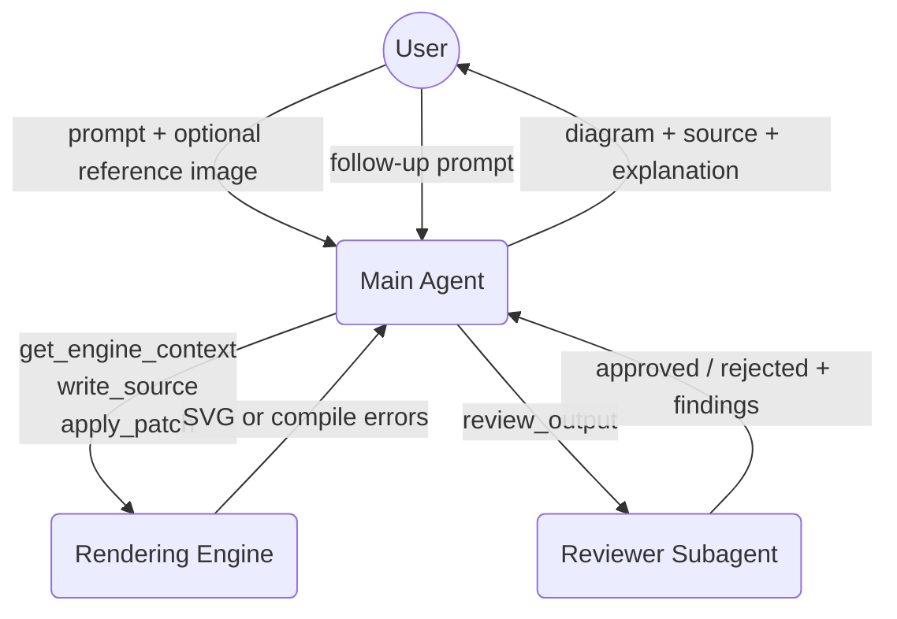
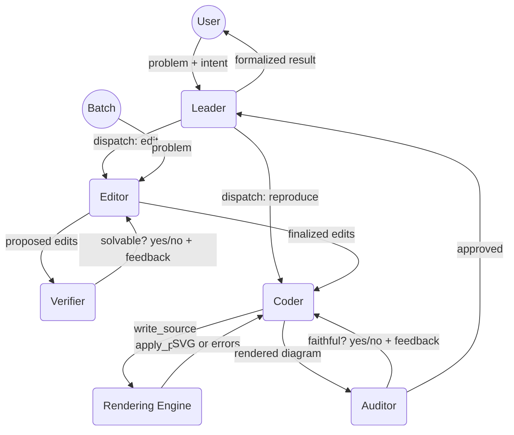
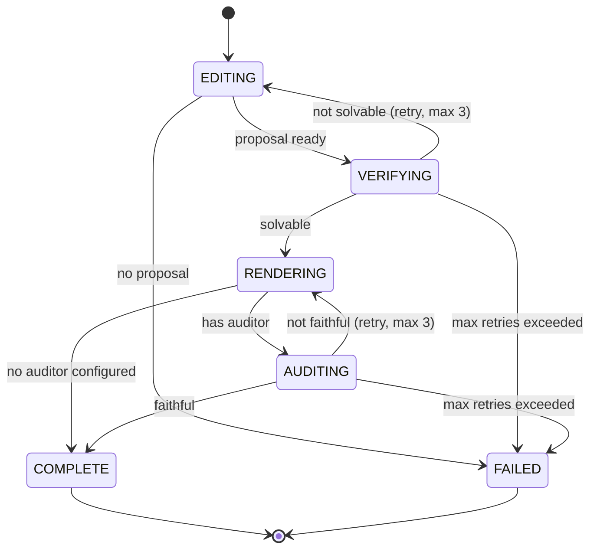
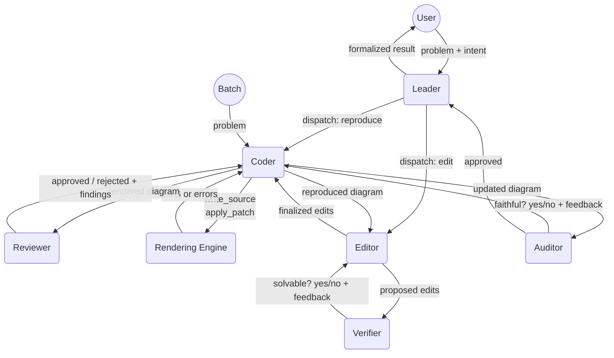
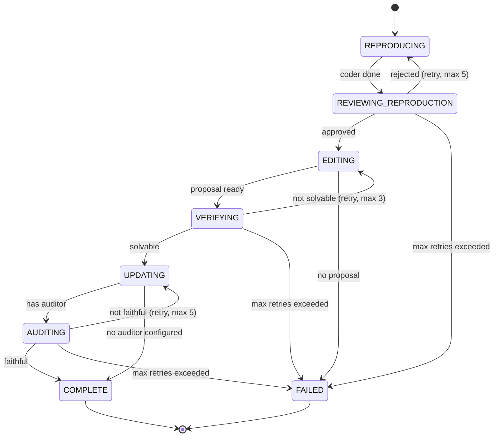
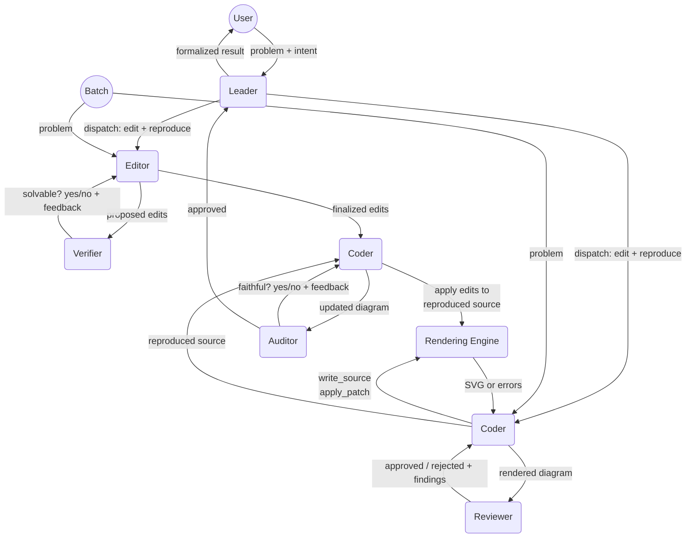

# Diagramma — Workflow Architecture

---

## Multi-Agent Problem Editing Architecture

Six agents. Two implemented workflow variations (A and B), one proposed (C). Backwards-compatible with user-facing chat.

In **batch mode**, the pipeline runs autonomously without the Leader — problems flow directly through the agent sequence. The **Leader** is only involved when a user interacts via chat.

### Agents

| Agent | Role |
|---|---|
| **Leader** | User-facing only. Classifies intent, dispatches to Editor or Coder, formalizes results. Not involved in batch processing. |
| **Editor** | Proposes edits to a problem (question, options, answer, images). |
| **Coder** | Reproduces/renders the problem's diagram via the rendering engine tool loop. *(Renamed from "Main Agent".)* |
| **Verifier** | Checks whether the edited problem is still solvable and internally consistent. |
| **Reviewer** | Visually compares rendered diagram against reference. *(Independent agent, no longer a Coder subagent.)* |
| **Auditor** | Verifies the final diagram is faithful to the edited problem. Runs after the Coder's last pass, before completion. |

---

### Variation A: Edit-First

The problem is edited before the diagram is rendered. The Coder renders a diagram for the *edited* problem. The Auditor then verifies faithfulness — if rejected, the Coder re-renders.

> **Fragility note:** The Reviewer is not used in Variation A. The original reference image depicts the *pre-edit* state, so visual comparison is unreliable. The Auditor provides the quality gate instead.

**Sequence:** Editor ↔ Verifier → Coder ↔ Auditor → Output

1. **Editor** proposes edits to the problem (question text, options, answer, images)
2. **Verifier** checks the edited problem is still solvable — loops with Editor if not
3. **Coder** renders a diagram for the finalized edited problem
4. **Auditor** verifies the rendered diagram is faithful to the edited problem — loops with Coder if not
5. Output: edited problem + rendered diagram

---

### Variation B: Reproduction-First

The original diagram is reproduced first, then edits are applied. This gives the Editor the reproduced source code as context, and allows a second Coder pass to update the diagram after edits. The Auditor verifies faithfulness after the update phase.

**Sequence:** Coder ↔ Reviewer → Editor ↔ Verifier → Coder ↔ Auditor → Output

1. **Coder** reproduces the original diagram from the reference image
2. **Reviewer** compares the reproduction against the original reference — loops with Coder if rejected
3. **Editor** proposes edits to the problem (now with the reproduced source code as context)
4. **Verifier** checks the edited problem is still solvable — loops with Editor if not
5. **Coder** updates the diagram to match the edited problem
6. **Auditor** verifies the updated diagram is faithful to the edited problem — loops with Coder if not
7. Output: edited problem + updated diagram

---

### Variation C: Parallel (Proposed)

The editing and reproduction processes have no dependencies between them — they can run simultaneously. After both complete, the Coder applies the edits to the reproduced source and the Auditor validates faithfulness.

> **Status:** Not yet implemented. Variation B is used by the batch processor.

**Sequence:** (Editor ↔ Verifier ‖ Coder ↔ Reviewer) → Coder ↔ Auditor → Output

1. **In parallel:**
   - **Editor** proposes edits; **Verifier** checks solvability — loops until valid
   - **Coder** reproduces the original diagram; **Reviewer** compares against reference — loops until approved
2. Both streams join: **Coder** receives the finalized edits + reproduced source, applies edits to the diagram
3. **Auditor** verifies the updated diagram is faithful to the edited problem — loops with Coder if not
4. Output: edited problem + updated diagram

---

### Auditor Agent

The auditor is a self-contained LLM loop that verifies whether the final rendered diagram is **faithful** to the edited problem. It runs after the last Coder pass (RENDERING in Variation A, UPDATING in Variation B) and before pipeline completion.

**Tools:**

| Tool | Purpose |
|------|---------|
| `crop_region` | Crop a specific region from the rendered diagram for closer inspection |
| `compute` | Execute a Python snippet to verify numerical/geometric properties |

**Result:**

| Field | Description |
|-------|-------------|
| `faithful` | `true` (diagram matches the edited problem) or `false` (mismatch detected) |
| `confidence` | Confidence score (0–1) |
| `issues` | List of specific faithfulness issues found |
| `feedback` | Actionable feedback for the Coder on what to fix (passed on rejection) |

**Behavior on rejection:** The auditor's feedback is fed back to the Coder, which re-renders/re-updates the diagram. This loop repeats up to the configured max retries (same as the coder-reviewer retry limit). If the auditor produces no parseable result after internal retries, it auto-approves to avoid pipeline deadlock.

**Optional:** The auditor is only invoked if an `auditor` LLM is configured in agent settings. If unconfigured, the pipeline skips directly from RENDERING/UPDATING to COMPLETE.

---
